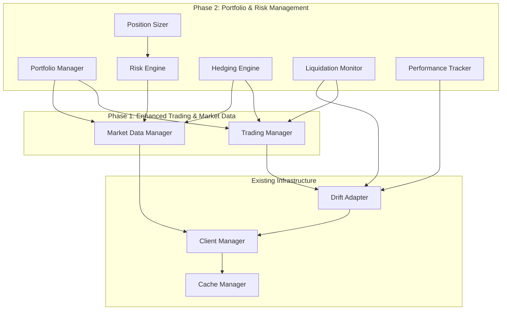

# Design Document

## Overview

This design document specifies the implementation of Phase 2 of ADR 008: Portfolio & Risk Management capabilities for the Drift Protocol integration. Building upon the successful Phase 1 implementation of enhanced trading and market data operations, Phase 2 introduces sophisticated portfolio analytics, risk management tools, automated hedging, and liquidation protection.

The design follows the established patterns from Phase 1, maintaining backward compatibility while providing professional-grade portfolio management capabilities. The system will integrate seamlessly with existing trading and market data managers to provide comprehensive risk management and portfolio optimization.

## Architecture

### High-Level Architecture



### Component Integration

The Portfolio & Risk Management system integrates with existing components through well-defined interfaces:

- **Portfolio Manager**: Central orchestrator for all portfolio operations
- **Risk Engine**: Specialized calculation engine for risk metrics
- **Hedging Engine**: Automated delta-neutral maintenance system
- **Liquidation Monitor**: Proactive liquidation protection system
- **Performance Tracker**: Historical analysis and reporting system
- **Position Sizer**: Intelligent position sizing recommendations

## Components and Interfaces

### 1. Portfolio Manager (`DriftPortfolioManager`)

**Primary Interface:**
```python
class DriftPortfolioManager:
    async def get_portfolio_summary() -> PortfolioSummary
    async def get_position_breakdown() -> List[PositionAnalysis]
    async def calculate_portfolio_risk() -> RiskMetrics
    async def set_risk_limits(limits: RiskLimits) -> bool
    async def check_risk_limits() -> List[RiskViolation]
    async def auto_hedge_portfolio(target_delta: float = 0.0) -> List[str]
    async def suggest_position_sizes(market: str, strategy: str, risk_tolerance: float) -> PositionSizing
    async def rebalance_portfolio(target_allocations: Dict[str, float]) -> RebalanceResult
```

**Key Responsibilities:**
- Aggregate portfolio data from multiple sources
- Coordinate risk calculations and monitoring
- Execute automated hedging and rebalancing
- Enforce risk limits and position constraints
- Provide unified interface for portfolio operations

### 2. Risk Engine (`DriftRiskEngine`)

**Primary Interface:**
```python
class DriftRiskEngine:
    async def calculate_var(confidence_level: float = 0.95, horizon_days: int = 1) -> VaRResult
    async def calculate_performance_metrics() -> PerformanceMetrics
    async def calculate_drawdown_analysis() -> DrawdownAnalysis
    async def calculate_correlation_matrix() -> CorrelationMatrix
    async def calculate_volatility_metrics() -> VolatilityMetrics
    async def calculate_beta_analysis() -> BetaAnalysis
    async def monitor_risk_changes() -> RiskChangeAlert
```

**Risk Calculation Methods:**
- **Value at Risk (VaR)**: Historical simulation and parametric methods
- **Expected Shortfall**: Conditional VaR for tail risk assessment
- **Volatility Modeling**: EWMA and GARCH models for volatility forecasting
- **Correlation Analysis**: Dynamic correlation tracking with regime detection
- **Stress Testing**: Scenario analysis for extreme market conditions

### 3. Hedging Engine (`DriftHedgingEngine`)

**Primary Interface:**
```python
class DriftHedgingEngine:
    async def calculate_hedge_requirements(target_delta: float) -> HedgeRequirements
    async def execute_hedge_trades(requirements: HedgeRequirements) -> HedgeResult
    async def monitor_hedge_effectiveness() -> HedgeMonitoring
    async def adjust_hedge_ratios(new_correlations: CorrelationMatrix) -> bool
    async def emergency_hedge(max_trades: int = 5) -> EmergencyHedgeResult
```

**Hedging Strategies:**
- **Delta Hedging**: Maintain portfolio delta neutrality
- **Correlation-Based Hedging**: Account for inter-market relationships
- **Volatility Hedging**: Hedge against volatility changes
- **Dynamic Hedging**: Adjust hedge ratios based on market conditions

### 4. Liquidation Monitor (`DriftLiquidationMonitor`)

**Primary Interface:**
```python
class DriftLiquidationMonitor:
    async def monitor_health_ratio() -> HealthStatus
    async def calculate_liquidation_prices() -> Dict[str, float]
    async def assess_liquidation_risk() -> LiquidationRisk
    async def execute_protection_actions(risk_level: str) -> ProtectionResult
    async def simulate_stress_scenarios() -> StressTestResult
```

**Protection Mechanisms:**
- **Health Ratio Monitoring**: Continuous tracking of account safety
- **Liquidation Price Calculation**: Real-time liquidation price updates
- **Stress Testing**: Scenario analysis for extreme price movements
- **Automated Protection**: Graduated response to increasing risk levels

## Data Models

### Core Data Structures

```python
@dataclass
class PortfolioSummary:
    total_value: float
    unrealized_pnl: float
    realized_pnl: float
    margin_used: float
    margin_available: float
    leverage: float
    health_ratio: float
    positions: List[Position]
    open_orders: List[Order]
    last_updated: datetime

@dataclass
class RiskMetrics:
    var_1d: float  # 1-day Value at Risk (95% confidence)
    var_7d: float  # 7-day Value at Risk (95% confidence)
    expected_shortfall_1d: float  # Expected loss beyond VaR
    max_drawdown: float  # Maximum historical drawdown
    current_drawdown: float  # Current drawdown from peak
    sharpe_ratio: float  # Risk-adjusted return metric
    sortino_ratio: float  # Downside risk-adjusted return
    calmar_ratio: float  # Return to max drawdown ratio
    volatility_annualized: float  # Annualized portfolio volatility
    beta_sol: float  # Beta relative to SOL
    beta_btc: float  # Beta relative to BTC
    correlation_matrix: Dict[str, Dict[str, float]]
    risk_contribution: Dict[str, float]  # Risk contribution by position

@dataclass
class PositionAnalysis:
    market: str
    size: float
    entry_price: float
    current_price: float
    unrealized_pnl: float
    realized_pnl: float
    total_pnl: float
    risk_contribution: float
    volatility: float
    beta: float
    correlation_to_portfolio: float
    liquidation_price: float
    margin_requirement: float
    
@dataclass
class RiskLimits:
    max_portfolio_leverage: float = 5.0
    max_position_size_usd: float = 50000.0
    max_position_size_percent: float = 0.3  # 30% of portfolio
    max_correlation_exposure: float = 0.7
    max_var_1d_percent: float = 0.05  # 5% of portfolio
    min_health_ratio: float = 150.0
    max_drawdown_percent: float = 0.15  # 15% max drawdown

@dataclass
class HedgeRequirements:
    target_delta: float
    current_delta: float
    delta_deviation: float
    required_trades: List[HedgeTrade]
    estimated_cost: float
    market_impact: float
    confidence_score: float

@dataclass
class HedgeTrade:
    market: str
    side: str  # "buy" or "sell"
    size: float
    hedge_ratio: float
    priority: int  # 1 = highest priority
    reasoning: str

@dataclass
class LiquidationRisk:
    health_ratio: float
    liquidation_prices: Dict[str, float]  # per market
    time_to_liquidation: Optional[timedelta]
    risk_level: str  # "low", "medium", "high", "critical"
    protection_actions: List[str]
    stress_test_results: Dict[str, float]  # scenario -> health_ratio

@dataclass
class PerformanceMetrics:
    total_return: float
    annualized_return: float
    volatility: float
    sharpe_ratio: float
    sortino_ratio: float
    calmar_ratio: float
    max_drawdown: float
    win_rate: float
    profit_factor: float
    average_win: float
    average_loss: float
    largest_win: float
    largest_loss: float
    total_trades: int
    winning_trades: int
    losing_trades: int
```

### Risk Calculation Models

#### Value at Risk (VaR) Implementation

```python
class VaRCalculator:
    """Value at Risk calculation using multiple methods."""
    
    async def historical_simulation_var(
        self,
        returns: List[float],
        confidence_level: float = 0.95,
        horizon_days: int = 1
    ) -> float:
        """Calculate VaR using historical simulation method."""
        
    async def parametric_var(
        self,
        portfolio_value: float,
        volatility: float,
        confidence_level: float = 0.95,
        horizon_days: int = 1
    ) -> float:
        """Calculate VaR using parametric method (normal distribution)."""
        
    async def monte_carlo_var(
        self,
        portfolio_composition: Dict[str, float],
        correlation_matrix: np.ndarray,
        volatilities: Dict[str, float],
        confidence_level: float = 0.95,
        horizon_days: int = 1,
        simulations: int = 10000
    ) -> float:
        """Calculate VaR using Monte Carlo simulation."""
```

#### Correlation and Volatility Models

```python
class VolatilityModel:
    """Advanced volatility modeling for risk calculations."""
    
    async def ewma_volatility(
        self,
        returns: List[float],
        lambda_param: float = 0.94
    ) -> float:
        """Exponentially Weighted Moving Average volatility."""
        
    async def garch_volatility(
        self,
        returns: List[float],
        p: int = 1,
        q: int = 1
    ) -> float:
        """GARCH(p,q) volatility model."""
        
    async def realized_volatility(
        self,
        high_freq_returns: List[float]
    ) -> float:
        """Realized volatility from high-frequency data."""

class CorrelationModel:
    """Dynamic correlation modeling."""
    
    async def rolling_correlation(
        self,
        returns_x: List[float],
        returns_y: List[float],
        window: int = 30
    ) -> List[float]:
        """Rolling correlation calculation."""
        
    async def ewma_correlation(
        self,
        returns_x: List[float],
        returns_y: List[float],
        lambda_param: float = 0.94
    ) -> float:
        """EWMA correlation calculation."""
        
    async def dcc_correlation(
        self,
        returns_matrix: np.ndarray
    ) -> np.ndarray:
        """Dynamic Conditional Correlation model."""
```

## Correctness Properties

*A property is a characteristic or behavior that should hold true across all valid executions of a system-essentially, a formal statement about what the system should do. Properties serve as the bridge between human-readable specifications and machine-verifiable correctness guarantees.*

### Property-Based Testing Analysis

<function_calls>
<invoke name="prework">
<parameter name="featureName">drift-portfolio-risk-management