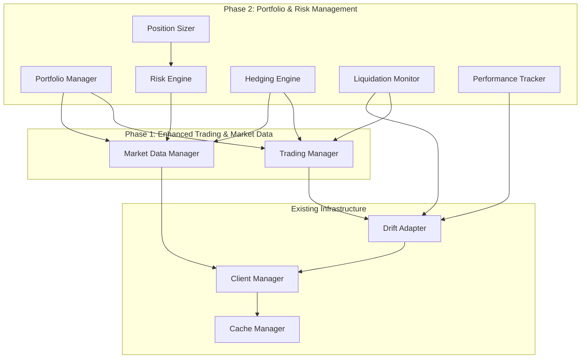

# Design Document

## Overview

This design document specifies the implementation of Phase 2 of ADR 008: Portfolio & Risk Management capabilities for the Drift Protocol integration. Building upon the successful Phase 1 implementation of enhanced trading and market data operations, Phase 2 introduces sophisticated portfolio analytics, risk management tools, automated hedging, and liquidation protection.

The design follows the established patterns from Phase 1, maintaining backward compatibility while providing professional-grade portfolio management capabilities. The system will integrate seamlessly with existing trading and market data managers to provide comprehensive risk management and portfolio optimization.

## Architecture

### High-Level Architecture



### Component Integration

The Portfolio & Risk Management system integrates with existing components through well-defined interfaces:

- **Portfolio Manager**: Central orchestrator for all portfolio operations
- **Risk Engine**: Specialized calculation engine for risk metrics
- **Hedging Engine**: Automated delta-neutral maintenance system
- **Liquidation Monitor**: Proactive liquidation protection system
- **Performance Tracker**: Historical analysis and reporting system
- **Position Sizer**: Intelligent position sizing recommendations

## Components and Interfaces

### 1. Portfolio Manager (`DriftPortfolioManager`)

**Primary Interface:**
```python
class DriftPortfolioManager:
    async def get_portfolio_summary() -> PortfolioSummary
    async def get_position_breakdown() -> List[PositionAnalysis]
    async def calculate_portfolio_risk() -> RiskMetrics
    async def set_risk_limits(limits: RiskLimits) -> bool
    async def check_risk_limits() -> List[RiskViolation]
    async def auto_hedge_portfolio(target_delta: float = 0.0) -> List[str]
    async def suggest_position_sizes(market: str, strategy: str, risk_tolerance: float) -> PositionSizing
    async def rebalance_portfolio(target_allocations: Dict[str, float]) -> RebalanceResult
```

**Key Responsibilities:**
- Aggregate portfolio data from multiple sources
- Coordinate risk calculations and monitoring
- Execute automated hedging and rebalancing
- Enforce risk limits and position constraints
- Provide unified interface for portfolio operations

### 2. Risk Engine (`DriftRiskEngine`)

**Primary Interface:**
```python
class DriftRiskEngine:
    async def calculate_var(confidence_level: float = 0.95, horizon_days: int = 1) -> VaRResult
    async def calculate_performance_metrics() -> PerformanceMetrics
    async def calculate_drawdown_analysis() -> DrawdownAnalysis
    async def calculate_correlation_matrix() -> CorrelationMatrix
    async def calculate_volatility_metrics() -> VolatilityMetrics
    async def calculate_beta_analysis() -> BetaAnalysis
    async def monitor_risk_changes() -> RiskChangeAlert
```

**Risk Calculation Methods:**
- **Value at Risk (VaR)**: Historical simulation and parametric methods
- **Expected Shortfall**: Conditional VaR for tail risk assessment
- **Volatility Modeling**: EWMA and GARCH models for volatility forecasting
- **Correlation Analysis**: Dynamic correlation tracking with regime detection
- **Stress Testing**: Scenario analysis for extreme market conditions

### 3. Hedging Engine (`DriftHedgingEngine`)

**Primary Interface:**
```python
class DriftHedgingEngine:
    async def calculate_hedge_requirements(target_delta: float) -> HedgeRequirements
    async def execute_hedge_trades(requirements: HedgeRequirements) -> HedgeResult
    async def monitor_hedge_effectiveness() -> HedgeMonitoring
    async def adjust_hedge_ratios(new_correlations: CorrelationMatrix) -> bool
    async def emergency_hedge(max_trades: int = 5) -> EmergencyHedgeResult
```

**Hedging Strategies:**
- **Delta Hedging**: Maintain portfolio delta neutrality
- **Correlation-Based Hedging**: Account for inter-market relationships
- **Volatility Hedging**: Hedge against volatility changes
- **Dynamic Hedging**: Adjust hedge ratios based on market conditions

### 4. Liquidation Monitor (`DriftLiquidationMonitor`)

**Primary Interface:**
```python
class DriftLiquidationMonitor:
    async def monitor_health_ratio() -> HealthStatus
    async def calculate_liquidation_prices() -> Dict[str, float]
    async def assess_liquidation_risk() -> LiquidationRisk
    async def execute_protection_actions(risk_level: str) -> ProtectionResult
    async def simulate_stress_scenarios() -> StressTestResult
```

**Protection Mechanisms:**
- **Health Ratio Monitoring**: Continuous tracking of account safety
- **Liquidation Price Calculation**: Real-time liquidation price updates
- **Stress Testing**: Scenario analysis for extreme price movements
- **Automated Protection**: Graduated response to increasing risk levels

## Data Models

### Core Data Structures

```python
@dataclass
class PortfolioSummary:
    total_value: float
    unrealized_pnl: float
    realized_pnl: float
    margin_used: float
    margin_available: float
    leverage: float
    health_ratio: float
    positions: List[Position]
    open_orders: List[Order]
    last_updated: datetime

@dataclass
class RiskMetrics:
    var_1d: float  # 1-day Value at Risk (95% confidence)
    var_7d: float  # 7-day Value at Risk (95% confidence)
    expected_shortfall_1d: float  # Expected loss beyond VaR
    max_drawdown: float  # Maximum historical drawdown
    current_drawdown: float  # Current drawdown from peak
    sharpe_ratio: float  # Risk-adjusted return metric
    sortino_ratio: float  # Downside risk-adjusted return
    calmar_ratio: float  # Return to max drawdown ratio
    volatility_annualized: float  # Annualized portfolio volatility
    beta_sol: float  # Beta relative to SOL
    beta_btc: float  # Beta relative to BTC
    correlation_matrix: Dict[str, Dict[str, float]]
    risk_contribution: Dict[str, float]  # Risk contribution by position

@dataclass
class PositionAnalysis:
    market: str
    size: float
    entry_price: float
    current_price: float
    unrealized_pnl: float
    realized_pnl: float
    total_pnl: float
    risk_contribution: float
    volatility: float
    beta: float
    correlation_to_portfolio: float
    liquidation_price: float
    margin_requirement: float
    
@dataclass
class RiskLimits:
    max_portfolio_leverage: float = 5.0
    max_position_size_usd: float = 50000.0
    max_position_size_percent: float = 0.3  # 30% of portfolio
    max_correlation_exposure: float = 0.7
    max_var_1d_percent: float = 0.05  # 5% of portfolio
    min_health_ratio: float = 150.0
    max_drawdown_percent: float = 0.15  # 15% max drawdown

@dataclass
class HedgeRequirements:
    target_delta: float
    current_delta: float
    delta_deviation: float
    required_trades: List[HedgeTrade]
    estimated_cost: float
    market_impact: float
    confidence_score: float

@dataclass
class HedgeTrade:
    market: str
    side: str  # "buy" or "sell"
    size: float
    hedge_ratio: float
    priority: int  # 1 = highest priority
    reasoning: str

@dataclass
class LiquidationRisk:
    health_ratio: float
    liquidation_prices: Dict[str, float]  # per market
    time_to_liquidation: Optional[timedelta]
    risk_level: str  # "low", "medium", "high", "critical"
    protection_actions: List[str]
    stress_test_results: Dict[str, float]  # scenario -> health_ratio

@dataclass
class PerformanceMetrics:
    total_return: float
    annualized_return: float
    volatility: float
    sharpe_ratio: float
    sortino_ratio: float
    calmar_ratio: float
    max_drawdown: float
    win_rate: float
    profit_factor: float
    average_win: float
    average_loss: float
    largest_win: float
    largest_loss: float
    total_trades: int
    winning_trades: int
    losing_trades: int
```

### Risk Calculation Models

#### Value at Risk (VaR) Implementation

```python
class VaRCalculator:
    """Value at Risk calculation using multiple methods."""
    
    async def historical_simulation_var(
        self,
        returns: List[float],
        confidence_level: float = 0.95,
        horizon_days: int = 1
    ) -> float:
        """Calculate VaR using historical simulation method."""
        
    async def parametric_var(
        self,
        portfolio_value: float,
        volatility: float,
        confidence_level: float = 0.95,
        horizon_days: int = 1
    ) -> float:
        """Calculate VaR using parametric method (normal distribution)."""
        
    async def monte_carlo_var(
        self,
        portfolio_composition: Dict[str, float],
        correlation_matrix: np.ndarray,
        volatilities: Dict[str, float],
        confidence_level: float = 0.95,
        horizon_days: int = 1,
        simulations: int = 10000
    ) -> float:
        """Calculate VaR using Monte Carlo simulation."""
```

#### Correlation and Volatility Models

```python
class VolatilityModel:
    """Advanced volatility modeling for risk calculations."""
    
    async def ewma_volatility(
        self,
        returns: List[float],
        lambda_param: float = 0.94
    ) -> float:
        """Exponentially Weighted Moving Average volatility."""
        
    async def garch_volatility(
        self,
        returns: List[float],
        p: int = 1,
        q: int = 1
    ) -> float:
        """GARCH(p,q) volatility model."""
        
    async def realized_volatility(
        self,
        high_freq_returns: List[float]
    ) -> float:
        """Realized volatility from high-frequency data."""

class CorrelationModel:
    """Dynamic correlation modeling."""
    
    async def rolling_correlation(
        self,
        returns_x: List[float],
        returns_y: List[float],
        window: int = 30
    ) -> List[float]:
        """Rolling correlation calculation."""
        
    async def ewma_correlation(
        self,
        returns_x: List[float],
        returns_y: List[float],
        lambda_param: float = 0.94
    ) -> float:
        """EWMA correlation calculation."""
        
    async def dcc_correlation(
        self,
        returns_matrix: np.ndarray
    ) -> np.ndarray:
        """Dynamic Conditional Correlation model."""
```

## Correctness Properties

*A property is a characteristic or behavior that should hold true across all valid executions of a system-essentially, a formal statement about what the system should do. Properties serve as the bridge between human-readable specifications and machine-verifiable correctness guarantees.*

### Property 1: Portfolio Summary Completeness
*For any* portfolio state, when requesting a portfolio summary, the returned data should contain all required fields: total value, unrealized PnL, realized PnL, margin used, margin available, leverage, and all active positions
**Validates: Requirements 1.1**

### Property 2: Position Analysis Completeness
*For any* portfolio with positions, when requesting position breakdown, each position analysis should contain all required fields: entry price, current price, size, PnL, risk contribution, and liquidation price
**Validates: Requirements 1.2**

### Property 3: Allocation Percentage Consistency
*For any* portfolio composition, the sum of all allocation percentages by market, asset class, and strategy should equal 100% (within rounding tolerance of 0.01%)
**Validates: Requirements 1.3**

### Property 4: Financial Calculation Accuracy
*For any* portfolio state, leverage ratio should equal total position value divided by account equity, and margin utilization should equal used margin divided by total margin
**Validates: Requirements 1.4**

### Property 5: VaR Calculation Bounds
*For any* return series, calculated VaR should be negative (representing potential loss) and the absolute value should be less than the maximum historical loss in the series
**Validates: Requirements 2.1**

### Property 6: Financial Ratio Mathematical Correctness
*For any* return series with non-zero volatility, Sharpe ratio should equal (mean return - risk-free rate) / volatility, and Sortino ratio should use only downside volatility
**Validates: Requirements 2.2**

### Property 7: Drawdown Calculation Properties
*For any* price series, maximum drawdown should be non-positive, current drawdown should be between maximum drawdown and zero, and drawdown duration should be non-negative
**Validates: Requirements 2.3**

### Property 8: Correlation Matrix Properties
*For any* correlation matrix, it should be symmetric, have 1.0 on the diagonal, and all values should be between -1.0 and 1.0
**Validates: Requirements 2.4**

### Property 9: Volatility Calculation Consistency
*For any* portfolio with positions, the sum of individual position volatility contributions should approximately equal the total portfolio volatility
**Validates: Requirements 2.5**

### Property 10: Beta Calculation Bounds
*For any* return series pair, calculated beta should be finite and the correlation coefficient used in beta calculation should be between -1.0 and 1.0
**Validates: Requirements 2.6**

### Property 11: Delta Hedging Effectiveness
*For any* portfolio after hedging execution, the portfolio delta should be within the specified tolerance of the target delta
**Validates: Requirements 3.1**

### Property 12: Hedge Size Calculation Accuracy
*For any* portfolio requiring hedging, the sum of position-weighted deltas plus hedge trade deltas should equal the target delta
**Validates: Requirements 3.2**

### Property 13: Hedge Order Type Consistency
*For any* hedge execution, all generated trades should be limit orders with prices within reasonable market bounds (±5% of current market price)
**Validates: Requirements 3.3**

### Property 14: Hedging Cooldown Enforcement
*For any* sequence of hedge requests, if a cooldown period is active, subsequent hedge requests should be rejected or queued until the cooldown expires
**Validates: Requirements 3.5**

### Property 15: Risk Limit Enforcement
*For any* trade request that would violate configured risk limits, the trade should be rejected and a detailed violation explanation should be provided
**Validates: Requirements 4.1, 4.2**

### Property 16: Warning Threshold Accuracy
*For any* position approaching limits, warnings should be generated when the position reaches exactly 80% and 90% of the configured limit thresholds
**Validates: Requirements 4.4**

### Property 17: Health Ratio Alert Thresholds
*For any* account with health ratio below 150%, warning alerts should be generated; below 120%, automatic position reduction should occur; below 110%, emergency closure should execute
**Validates: Requirements 5.1, 5.2, 5.3**

### Property 18: Liquidation Protection Prioritization
*For any* portfolio requiring protection, positions should be closed in descending order of their risk contribution to the portfolio
**Validates: Requirements 5.5**

### Property 19: Performance Calculation Accuracy
*For any* price history, calculated returns over different time periods should be mathematically consistent with the price changes over those periods
**Validates: Requirements 6.1**

### Property 20: Trade Statistics Consistency
*For any* trade history, win rate should equal winning trades divided by total trades, and profit factor should equal total wins divided by total losses
**Validates: Requirements 6.3**

### Property 21: Position Sizing Risk Consistency
*For any* position sizing recommendation, the resulting portfolio risk should remain within the specified target risk levels
**Validates: Requirements 7.4**

### Property 22: Risk Budget Allocation Conservation
*For any* risk budget allocation, the sum of allocated risk across all positions should equal the total available risk budget
**Validates: Requirements 7.3**

### Property 23: Rebalancing Weight Accuracy
*For any* portfolio rebalancing, the resulting position weights should be within the specified tolerance bands of the target allocations
**Validates: Requirements 9.1**

### Property 24: Rebalancing Trade Size Minimization
*For any* rebalancing execution, the total trade size should be the minimum required to achieve target allocations within tolerance
**Validates: Requirements 9.2**

### Property 25: Integration Backward Compatibility
*For any* existing system integration point, the enhanced portfolio manager should maintain the same interface contracts and provide graceful fallbacks when enhanced features are unavailable
**Validates: Requirements 10.5**

<function_calls>
<invoke name="prework">
<parameter name="featureName">drift-portfolio-risk-management

## Error Handling

### Error Classification and Response

The Portfolio & Risk Management system implements comprehensive error handling across all components:

#### 1. Data Quality Errors
- **Missing Market Data**: Graceful degradation with cached data and user warnings
- **Stale Price Data**: Automatic refresh attempts with fallback to last known good data
- **Incomplete Position Data**: Request retry with exponential backoff

#### 2. Calculation Errors
- **Numerical Instability**: Input validation and range checking before calculations
- **Division by Zero**: Explicit checks for zero volatility, zero returns, and zero positions
- **Matrix Singularity**: Regularization techniques for correlation matrix calculations

#### 3. Trading Execution Errors
- **Order Rejection**: Retry logic with adjusted parameters and detailed error logging
- **Insufficient Margin**: Pre-trade validation and alternative sizing recommendations
- **Market Connectivity**: Automatic reconnection with circuit breaker patterns

#### 4. Risk Limit Violations
- **Soft Limits**: Warnings with recommended actions and grace periods
- **Hard Limits**: Immediate trade rejection with detailed violation explanations
- **Emergency Situations**: Automated risk reduction with comprehensive audit trails

### Error Recovery Strategies

```python
class ErrorRecoveryManager:
    """Centralized error recovery for portfolio operations."""
    
    async def handle_calculation_error(self, error: Exception, context: Dict) -> Any:
        """Handle calculation errors with appropriate fallbacks."""
        
    async def handle_trading_error(self, error: Exception, trade: Dict) -> TradeResult:
        """Handle trading errors with retry and adjustment logic."""
        
    async def handle_data_error(self, error: Exception, data_type: str) -> Any:
        """Handle data errors with caching and refresh strategies."""
```

## Testing Strategy

### Dual Testing Approach

The Portfolio & Risk Management system employs both unit testing and property-based testing for comprehensive coverage:

#### Unit Testing Focus
- **Specific Examples**: Test known scenarios with expected outcomes
- **Edge Cases**: Zero positions, extreme market conditions, boundary values
- **Integration Points**: Verify correct interaction with Phase 1 components
- **Error Conditions**: Validate error handling and recovery mechanisms

#### Property-Based Testing Focus
- **Mathematical Correctness**: Verify financial calculations across random inputs
- **Risk Metric Properties**: Ensure VaR, volatility, and correlation calculations are mathematically sound
- **Portfolio Invariants**: Verify portfolio properties hold across all operations
- **Limit Enforcement**: Test risk limit enforcement across all possible scenarios

### Testing Configuration

- **Property Tests**: Minimum 100 iterations per test to ensure statistical validity
- **Test Data Generation**: Smart generators that create realistic market scenarios
- **Performance Testing**: Verify system performance under high-frequency updates
- **Integration Testing**: End-to-end testing with Phase 1 components

### Test Implementation Requirements

Each correctness property will be implemented as a property-based test with the following format:

```python
def test_property_N_description():
    """
    Feature: drift-portfolio-risk-management, Property N: Description
    Validates: Requirements X.Y
    """
    # Property-based test implementation
```

### Risk Calculation Testing

Special attention to financial calculation accuracy:

- **VaR Backtesting**: Historical validation of VaR predictions
- **Stress Testing**: Extreme scenario validation
- **Benchmark Comparison**: Verify calculations match industry standards
- **Numerical Stability**: Test with edge cases and extreme values

## Implementation Notes

### Performance Considerations

- **Caching Strategy**: Aggressive caching of expensive calculations with TTL management
- **Batch Processing**: Group related calculations to minimize API calls
- **Async Operations**: Non-blocking operations for real-time monitoring
- **Memory Management**: Efficient handling of large historical datasets

### Security Considerations

- **Input Validation**: Comprehensive validation of all user inputs and market data
- **Rate Limiting**: Respect Drift Protocol API limits with intelligent queuing
- **Error Information**: Careful balance between detailed errors and security
- **Audit Logging**: Comprehensive logging of all risk management actions

### Scalability Design

- **Modular Architecture**: Independent scaling of different risk components
- **Event-Driven Updates**: Efficient propagation of market data changes
- **Resource Pooling**: Shared resources across portfolio operations
- **Graceful Degradation**: Maintain core functionality under high load

### Integration Patterns

The system follows established patterns from Phase 1:

- **Singleton Management**: Reuse existing client management infrastructure
- **Backward Compatibility**: Maintain existing interfaces while adding new capabilities
- **Configuration Management**: Extend existing configuration patterns
- **Error Handling**: Consistent error handling across all components

This design ensures seamless integration with existing systems while providing professional-grade portfolio and risk management capabilities for sophisticated trading strategies.