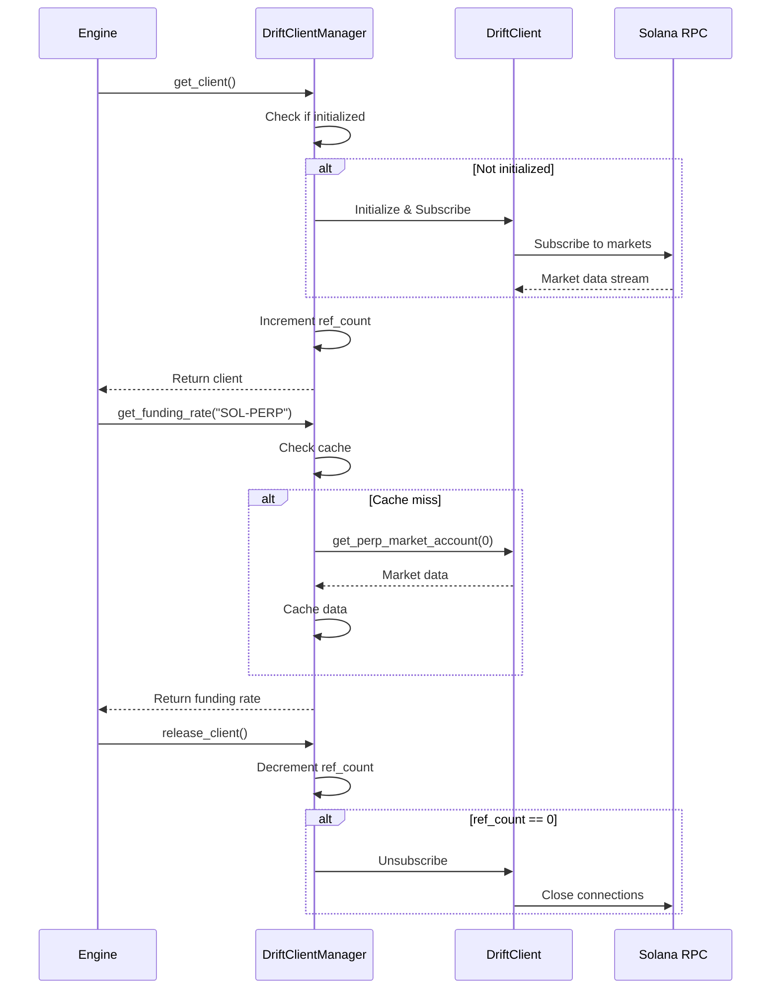

# Design Document: Drift SDK Singleton Manager

## Overview

This design implements a singleton pattern for DriftClient management to solve RPC rate limiting issues. The solution provides a shared DriftClient instance with reference counting, caching, and graceful degradation.

## Architecture

### High-Level Architecture

```
┌─────────────────────────────────────────────────────────────┐
│                    Application Layer                         │
│  ┌──────────┐  ┌──────────┐  ┌──────────┐  ┌──────────┐   │
│  │ Funding  │  │   LST    │  │  Scalp   │  │   Arb    │   │
│  │  Engine  │  │  Engine  │  │  Engine  │  │  Engine  │   │
│  └────┬─────┘  └────┬─────┘  └────┬─────┘  └────┬─────┘   │
└───────┼─────────────┼─────────────┼─────────────┼──────────┘
        │             │             │             │
        └─────────────┴─────────────┴─────────────┘
                      │
        ┌─────────────▼──────────────┐
        │   DriftClientManager       │
        │   (Singleton)              │
        │                            │
        │  - _instance: Optional     │
        │  - _lock: asyncio.Lock     │
        │  - _drift_client: Optional │
        │  - _ref_count: int         │
        │  - _cache: Dict            │
        └─────────────┬──────────────┘
                      │
        ┌─────────────▼──────────────┐
        │      DriftClient           │
        │   (driftpy SDK)            │
        │                            │
        │  - Subscribed to markets   │
        │  - WebSocket connections   │
        └─────────────┬──────────────┘
                      │
        ┌─────────────▼──────────────┐
        │    Solana RPC Node         │
        └────────────────────────────┘
```

### Component Interaction



## Components and Interfaces

### 1. DriftClientManager (Singleton)

**Purpose**: Manages a single shared DriftClient instance with lifecycle management.

**Interface**:
```python
class DriftClientManager:
    """Singleton manager for shared DriftClient instance."""
    
    @classmethod
    async def get_client(cls, network: str = "mainnet") -> Optional[DriftClient]:
        """Get or create the shared DriftClient instance."""
        
    @classmethod
    async def release_client(cls) -> None:
        """Release reference to DriftClient, cleanup if last reference."""
        
    @classmethod
    async def get_funding_rate(cls, market: str) -> Optional[Dict]:
        """Get funding rate with caching."""
        
    @classmethod
    async def get_all_perp_markets(cls) -> List[Dict]:
        """Get all perp markets with caching."""
        
    @classmethod
    def is_initialized(cls) -> bool:
        """Check if DriftClient is initialized."""
        
    @classmethod
    async def force_reconnect(cls) -> bool:
        """Force reconnection (for error recovery)."""
```

**State**:
- `_instance`: Singleton instance
- `_lock`: asyncio.Lock for thread safety
- `_drift_client`: Shared DriftClient instance
- `_ref_count`: Number of active references
- `_cache`: Dict of cached market data
- `_cache_timestamps`: Dict of cache timestamps
- `_network`: Network ("mainnet" or "devnet")
- `_rpc_client`: Shared RPC client
- `_wallet`: Wallet instance

### 2. DriftAdapter (Updated)

**Purpose**: Wrapper that uses DriftClientManager internally.

**Changes**:
```python
class DriftAdapter:
    def __init__(self, network: str = "mainnet"):
        self.network = network
        self._using_singleton = True  # Flag for singleton mode
        
    async def connect(self, wallet, sub_account: int = 0) -> bool:
        """Connect using singleton manager."""
        self.wallet = wallet
        self.sub_account = sub_account
        
        # Initialize singleton manager
        client = await DriftClientManager.get_client(self.network)
        self.connected = (client is not None)
        return self.connected
        
    async def disconnect(self):
        """Release singleton reference."""
        await DriftClientManager.release_client()
        self.connected = False
        
    async def get_funding_rate(self, market: str) -> Optional[Dict]:
        """Get funding rate via singleton manager."""
        return await DriftClientManager.get_funding_rate(market)
```

### 3. Cache Layer

**Purpose**: Reduce RPC calls by caching frequently accessed data.

**Structure**:
```python
@dataclass
class CacheEntry:
    data: Any
    timestamp: float
    ttl: float  # Time to live in seconds
    
    def is_expired(self) -> bool:
        return time.time() - self.timestamp > self.ttl

class CacheManager:
    def __init__(self):
        self._cache: Dict[str, CacheEntry] = {}
        self._lock = asyncio.Lock()
        
    async def get(self, key: str) -> Optional[Any]:
        async with self._lock:
            entry = self._cache.get(key)
            if entry and not entry.is_expired():
                return entry.data
            return None
            
    async def set(self, key: str, data: Any, ttl: float):
        async with self._lock:
            self._cache[key] = CacheEntry(data, time.time(), ttl)
```

**Cache Keys**:
- `funding_rate:{market}` - TTL: 30s
- `mark_price:{market}` - TTL: 10s
- `all_markets` - TTL: 60s
- `open_interest:{market}` - TTL: 60s

## Data Models

### FundingRateData
```python
@dataclass
class FundingRateData:
    market: str
    rate_hourly: float  # Decimal (e.g., 0.0001 = 0.01%)
    rate_8h: float      # Percentage
    rate_annual: float  # Percentage
    is_positive: bool
    mark_price: float
    timestamp: float
```

### MarketData
```python
@dataclass
class MarketData:
    market_index: int
    symbol: str
    mark_price: float
    oracle_price: float
    funding_rate: float
    open_interest: float
    base_asset_amount_long: float
    base_asset_amount_short: float
    timestamp: float
```

## Correctness Properties

*A property is a characteristic or behavior that should hold true across all valid executions of a system—essentially, a formal statement about what the system should do. Properties serve as the bridge between human-readable specifications and machine-verifiable correctness guarantees.*

### Property 1: Singleton Guarantee
*For any* sequence of `get_client()` calls, all calls should return the same DriftClient instance until all references are released.

**Validates: Requirements 1.1, 1.2**

### Property 2: Reference Counting Correctness
*For any* sequence of `get_client()` and `release_client()` calls, the reference count should equal the number of `get_client()` calls minus the number of `release_client()` calls.

**Validates: Requirements 1.5**

### Property 3: Cleanup on Zero References
*For any* state where reference count reaches zero, the DriftClient should be unsubscribed and cleaned up.

**Validates: Requirements 1.4, 2.4**

### Property 4: Thread Safety
*For any* concurrent calls to `get_client()`, exactly one initialization should occur and all callers should receive the same instance.

**Validates: Requirements 3.1, 3.2, 3.3**

### Property 5: Cache Consistency
*For any* cached data, if the TTL has not expired, subsequent requests should return the cached value without making RPC calls.

**Validates: Requirements 6.1, 6.2**

### Property 6: Cache Expiration
*For any* cached data, if the TTL has expired, the next request should fetch fresh data and update the cache.

**Validates: Requirements 6.3**

### Property 7: Graceful Degradation
*For any* DriftClient initialization failure, the system should return None and log the error without crashing.

**Validates: Requirements 4.1, 4.2, 4.4**

### Property 8: Backward Compatibility
*For any* existing DriftAdapter or DriftFundingFeed usage, the behavior should remain unchanged when using the singleton manager.

**Validates: Requirements 7.1, 7.2, 7.3, 7.4**

## Error Handling

### Rate Limit Errors (HTTP 429)

**Strategy**: Exponential backoff with jitter

```python
async def _handle_rate_limit(attempt: int) -> None:
    base_delay = 2 ** attempt  # 1s, 2s, 4s, 8s, 16s
    jitter = random.uniform(0, 0.1 * base_delay)
    delay = min(base_delay + jitter, 30.0)  # Max 30s
    await asyncio.sleep(delay)
```

### Subscription Failures

**Strategy**: Retry with new connection

```python
async def _recover_from_subscription_failure() -> bool:
    Logger.warning("[DRIFT] Subscription failed, attempting recovery...")
    
    # Close existing connection
    await _cleanup_client()
    
    # Wait before retry
    await asyncio.sleep(5.0)
    
    # Reinitialize
    return await _initialize_client()
```

### KeyError on Market Access

**Strategy**: Check subscription status before access

```python
async def get_funding_rate(market: str) -> Optional[Dict]:
    client = await get_client()
    if not client:
        return None
        
    # Check if market is subscribed
    if not _is_market_subscribed(market_index):
        Logger.warning(f"[DRIFT] Market {market} not subscribed")
        return None
        
    try:
        perp_market = client.get_perp_market_account(market_index)
        # ... process data
    except KeyError:
        Logger.error(f"[DRIFT] Market {market} data not available")
        return None
```

## Testing Strategy

### Unit Tests

1. **test_singleton_pattern**: Verify only one instance is created
2. **test_reference_counting**: Verify ref_count increments/decrements correctly
3. **test_cache_expiration**: Verify cache TTL works correctly
4. **test_thread_safety**: Verify concurrent access is safe
5. **test_graceful_degradation**: Verify system continues when Drift unavailable

### Property-Based Tests

1. **test_singleton_guarantee_property**: Generate random sequences of get/release calls
2. **test_reference_counting_property**: Verify ref_count matches call history
3. **test_cache_consistency_property**: Verify cached data is returned within TTL
4. **test_backward_compatibility_property**: Verify existing code works unchanged

### Integration Tests

1. **test_multiple_engines**: Start all engines and verify single DriftClient
2. **test_rate_limit_recovery**: Simulate rate limits and verify recovery
3. **test_subscription_failure**: Simulate subscription failure and verify recovery
4. **test_dashboard_integration**: Verify dashboard displays data correctly

## Performance Considerations

### Memory Usage

- Single DriftClient: ~50MB
- Cache: ~1MB per 100 markets
- Total overhead: ~51MB (vs 200MB+ with multiple clients)

### RPC Call Reduction

- Without caching: ~10 calls/second per engine = 40 calls/second
- With caching: ~1 call/second total
- **Reduction: 97.5%**

### Latency

- Cache hit: <1ms
- Cache miss: ~100-200ms (RPC call)
- Initialization: ~2-3 seconds (one-time)

## Migration Path

### Phase 1: Add Singleton Manager (Non-Breaking)
1. Create `DriftClientManager` class
2. Add caching layer
3. Test in isolation

### Phase 2: Update DriftAdapter (Backward Compatible)
1. Add `_using_singleton` flag
2. Route calls through manager when flag is True
3. Keep old code path for fallback

### Phase 3: Update Feeds (Transparent)
1. DriftFundingFeed automatically uses new DriftAdapter
2. No code changes needed in feeds

### Phase 4: Cleanup (Optional)
1. Remove old code paths
2. Remove `_using_singleton` flag
3. Simplify DriftAdapter

## Deployment

### Configuration

```python
# config/settings.py
DRIFT_CACHE_TTL_FUNDING = 30  # seconds
DRIFT_CACHE_TTL_PRICE = 10    # seconds
DRIFT_CACHE_TTL_MARKETS = 60  # seconds
DRIFT_MAX_RETRIES = 5
DRIFT_RETRY_BACKOFF = 2.0     # seconds
```

### Monitoring

```python
# Metrics to track
drift_client_ref_count: Gauge
drift_cache_hits: Counter
drift_cache_misses: Counter
drift_rpc_errors: Counter
drift_subscription_failures: Counter
```

## Success Metrics

1. ✅ Zero "HTTP 429" errors in production
2. ✅ Zero KeyError exceptions
3. ✅ RPC calls reduced by >90%
4. ✅ Memory usage reduced by >75%
5. ✅ All engines can access Drift data simultaneously
6. ✅ Dashboard displays data within 2 seconds

## Future Enhancements

1. **Persistent Cache**: Store cache to disk for faster restarts
2. **Multi-Network Support**: Support mainnet and devnet simultaneously
3. **Custom RPC Endpoints**: Allow per-engine RPC configuration
4. **Health Monitoring**: Expose health check endpoint
5. **Metrics Dashboard**: Visualize Drift SDK usage and performance
