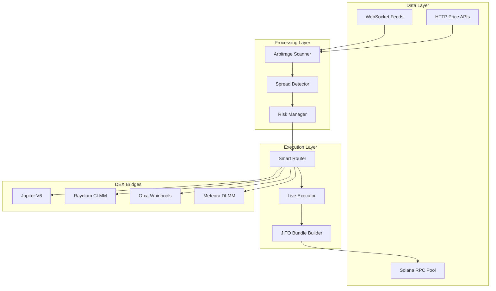

<div align="center">

# 🔮 PhantomArbiter

**Autonomous Solana DeFi Arbitrage & Trading Engine**

[](https://python.org)
[](https://solana.com)
[](LICENSE)
[](bridges/)

*A production-grade arbitrage detection and execution system for Solana DEXs*

</div>

---

## 📋 Overview

PhantomArbiter is a sophisticated, multi-strategy trading system designed for the Solana blockchain ecosystem. It combines real-time market data aggregation, intelligent signal processing, and MEV-protected execution to identify and capture arbitrage opportunities across decentralized exchanges.

### Key Capabilities

| Feature | Description |
|---------|-------------|
| **Multi-DEX Arbitrage** | Scans Jupiter, Raydium, Orca, and Meteora for price discrepancies |
| **Triangular Arbitrage** | Detects profitable 3-hop cycles (e.g., SOL→USDC→BONK→SOL) |
| **Funding Rate Arbitrage** | Cash-and-carry strategies via Drift Protocol integration |
| **MEV Protection** | JITO bundle submission to prevent front-running |
| **Paper Trading** | Full simulation mode with realistic slippage and fee modeling |
| **Real-time Dashboard** | Terminal-based UI with live P&L, spreads, and trade history |

---

## 🏗️ Architecture



---

## 🛠️ Technology Stack

### Backend (Python 3.12+)
- **Async I/O**: `asyncio`, `aiohttp`, `websockets`
- **Solana SDK**: `solders`, `solana-py`
- **Data Processing**: `numpy`, `pandas`
- **Configuration**: `pydantic`, `python-dotenv`

### TypeScript Bridges
- **DEX SDKs**: `@raydium-io/raydium-sdk-v2`, `@orca-so/whirlpools-sdk`, `@meteora-ag/dlmm`
- **Blockchain**: `@solana/web3.js`, `@coral-xyz/anchor`

### Infrastructure
- **RPC**: Helius, with automatic failover
- **MEV Protection**: JITO block engine integration
- **Persistence**: SQLite for trade journaling

---

## 🚀 Quick Start

### Prerequisites
- Python 3.12+
- Node.js 18+ (for TypeScript bridges)
- Solana wallet with SOL for gas

### Installation

```bash
# Clone the repository
git clone https://github.com/YourUsername/PhantomArbiter.git
cd PhantomArbiter

# Install Python dependencies
pip install -r requirements.txt

# Install TypeScript bridge dependencies
cd bridges && npm install && cd ..

# Configure environment
cp .env.example .env
# Edit .env with your API keys and wallet
```

### Running

```bash
# Paper trading mode (recommended for testing)
python main.py --paper

# Live monitoring (no execution)
python main.py --monitor

# Live trading (real funds)
python main.py --live
```

---

## 📁 Project Structure

```
PhantomArbiter/
├── main.py                 # Entry point & CLI
├── config/
│   ├── settings.py         # Global configuration
│   ├── thresholds.py       # Trading thresholds
│   └── rpc_pool.json       # RPC endpoint configuration
├── src/
│   ├── core/               # Core utilities & data management
│   ├── shared/
│   │   ├── execution/      # Trade execution (live & paper)
│   │   ├── feeds/          # Price feed integrations
│   │   ├── infrastructure/ # RPC, WebSocket, caching
│   │   └── system/         # Command processing, routing
│   ├── scraper/            # Token discovery & scouting
│   └── liquidity/          # CLMM/LP management
├── bridges/                # TypeScript DEX integrations
│   ├── raydium_daemon.ts
│   ├── meteora_dlmm.ts
│   └── execution_engine.ts
├── tests/                  # Unit & integration tests
└── docs/                   # Extended documentation
```

---

## 📚 Documentation

| Document | Description |
|----------|-------------|
| [Quick Start](docs/QUICKSTART.md) | Get running in 5 minutes |
| [Configuration](docs/CONFIGURATION.md) | All settings explained |
| [Architecture](docs/architecture.md) | System design deep-dive |
| [Trading Strategies](docs/TRADING_STRATEGIES.md) | Strategy implementations |
| [Risk Management](docs/RISK_MANAGEMENT.md) | Safety controls & limits |
| [Execution](docs/EXECUTION.md) | Trade execution details |
| [Troubleshooting](docs/TROUBLESHOOTING.md) | Common issues & solutions |

---

## ⚠️ Disclaimer

> **This software is for educational and research purposes only.**
> 
> - Trading cryptocurrencies involves substantial risk of loss
> - Past performance does not guarantee future results
> - The authors are not responsible for any financial losses
> - Always test thoroughly in paper trading mode before using real funds
> - This is not financial advice

---

## 📄 License

This project is licensed under the MIT License - see the [LICENSE](LICENSE) file for details.

---

## 🤝 Contributing

Contributions are welcome! Please see [CONTRIBUTING.md](CONTRIBUTING.md) for guidelines.

---

<div align="center">

**Built with ❤️ for the Solana ecosystem**

</div>
