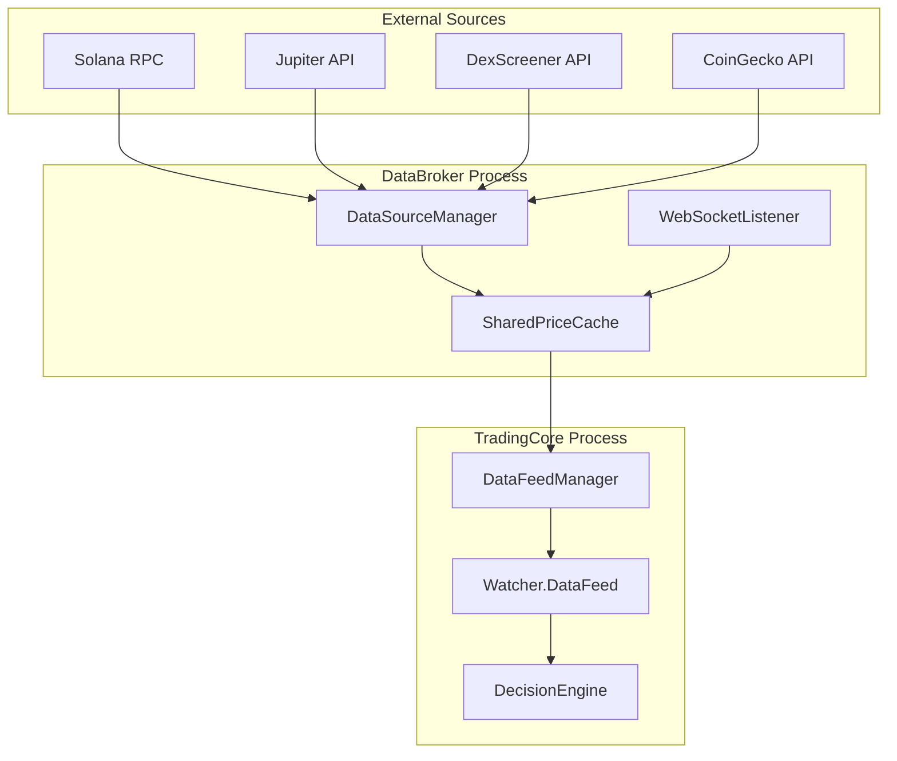

# PhantomTrader Data Pipeline

How data flows through the system, from blockchain to trading decisions.

---

## Data Flow Overview



---

## 1. Data Sources

### Tier 1: Jupiter/RPC (Primary)

**File:** `src/system/smart_router.py`

- **Source:** Jupiter SmartRouter API
- **Quality:** Highest precision
- **Limitation:** Rate-limited (10-100 req/s)

```python
class SmartRouter:
    def get_jupiter_quote(self, input_mint, output_mint, amount, slippage_bps):
        """Fetch price quote from Jupiter."""
        url = "https://quote-api.jup.ag/v6/quote"
        params = {
            "inputMint": input_mint,
            "outputMint": output_mint,
            "amount": amount,
            "slippageBps": slippage_bps
        }
        response = requests.get(url, params=params)
        return response.json()
```

### Tier 2: DexScreener (Fallback)

**File:** `src/system/data_source_manager.py`

- **Source:** DexScreener API
- **Quality:** Good, slightly delayed
- **Availability:** High (no rate limits)

```python
def _fetch_tier2(self, mints: list) -> dict:
    """Fetch from DexScreener (Fallback)."""
    prices = {}
    for mint in mints:
        url = f"https://api.dexscreener.com/latest/dex/tokens/{mint}"
        response = requests.get(url)
        data = response.json()
        if data.get("pairs"):
            prices[mint] = float(data["pairs"][0]["priceUsd"])
    return prices
```

### Tier 3: CoinGecko (Historical)

- **Purpose:** Price history backfill for RSI
- **Rate Limit:** 10-50 req/min (depends on API key)

---

## 2. DataSourceManager (DSM)

**File:** `src/system/data_source_manager.py`

Implements **Tiered Data Reliability**:

### Auto-Switching Logic

```python
class DataSourceManager:
    def get_prices(self, mints: list) -> dict:
        # Check if Tier 1 is blacklisted
        if self._is_tier1_blacklisted():
            return self._fetch_tier2(mints)
        
        # Try Tier 1 first
        try:
            prices = self._fetch_tier1(mints)
            if prices:
                self.current_tier = 1
                return prices
        except Exception as e:
            self._record_tier1_failure()
        
        # Fallback to Tier 2
        self.current_tier = 2
        return self._fetch_tier2(mints)
```

### RPC Blacklisting (V11.7)

```python
TIER1_FAILURE_THRESHOLD = 3    # Failures before blacklist
TIER1_BLACKLIST_DURATION = 7200  # 2 hours

def _record_tier1_failure(self):
    """Record failure and check blacklist threshold."""
    now = time.time()
    # Clean old failures (15 min window)
    self._tier1_failures = [
        t for t in self._tier1_failures 
        if now - t < 900
    ]
    self._tier1_failures.append(now)
    
    if len(self._tier1_failures) >= TIER1_FAILURE_THRESHOLD:
        self._tier1_blacklist_until = now + TIER1_BLACKLIST_DURATION
        Logger.warning("⚠️ Tier 1 blacklisted for 2 hours")
```

---

## 3. SharedPriceCache

**File:** `src/core/shared_cache.py`

Atomic file-based cache for **cross-process data sharing**:

### Architecture

```
DataBroker (Process 1)    TradingCore (Process 2)
         │                         │
         ▼                         ▼
    write_price()            get_price()
         │                         │
         └────► price_cache.json ◄─┘
                     │
              (FileLock protection)
```

### Cache Structure

```json
{
  "prices": {
    "SOL": {
      "price": 150.25,
      "source": "WSS",
      "timestamp": 1702761234.56,
      "history": [149.80, 150.10, 150.25]
    }
  },
  "wallet": {
    "usdc": 100.0,
    "sol": 0.05,
    "held_assets": {}
  },
  "broker": {
    "pid": 12345,
    "last_update": 1702761234.56
  },
  "safety": {
    "SOL": {
      "safe": true,
      "liquidity": 1000000,
      "timestamp": 1702761200.0
    }
  }
}
```

### Writing Prices

```python
@classmethod
def write_batch(cls, prices: dict, source: str = "BATCH"):
    """Write multiple prices with history tracking."""
    with cls._get_lock().acquire():
        data = cls._read_raw()
        now = time.time()
        
        for symbol, price in prices.items():
            if symbol not in data["prices"]:
                data["prices"][symbol] = {"history": []}
            
            entry = data["prices"][symbol]
            entry["price"] = price
            entry["source"] = source
            entry["timestamp"] = now
            
            # Maintain history (max 100 points)
            entry["history"].append(price)
            if len(entry["history"]) > 100:
                entry["history"] = entry["history"][-100:]
        
        cls._write_raw(data)
```

### Reading Prices

```python
@classmethod
def get_price(cls, symbol: str, max_age: float = 30.0) -> tuple:
    """
    Get price for a symbol.
    Returns: (price, source) or (None, None) if stale
    """
    with cls._get_lock().acquire():
        data = cls._read_raw()
        entry = data.get("prices", {}).get(symbol)
        
        if not entry:
            return None, None
        
        age = time.time() - entry.get("timestamp", 0)
        if age > max_age:
            return None, None
        
        return entry["price"], entry["source"]
```

---

## 4. DataFeed (Per-Asset)

**File:** `src/core/data.py`

Each Watcher maintains its own DataFeed:

```python
class DataFeed:
    """Price history and indicator cache for a single asset."""
    
    def __init__(self, symbol: str, max_history: int = 200):
        self.symbol = symbol
        self.prices = deque(maxlen=max_history)
        self.highs = deque(maxlen=max_history)
        self.lows = deque(maxlen=max_history)
        self.volumes = deque(maxlen=max_history)
        self._last_update = 0
    
    def add_price(self, price: float, high: float = None, low: float = None):
        """Add price point with optional OHLC data."""
        self.prices.append(price)
        self.highs.append(high or price)
        self.lows.append(low or price)
        self._last_update = time.time()
    
    def get_rsi(self, period: int = 14) -> float:
        """Calculate RSI from price history."""
        return TechnicalAnalysis.calculate_rsi(list(self.prices), period)
    
    def get_atr(self, period: int = 14) -> float:
        """Calculate ATR from OHLC data."""
        return TechnicalAnalysis.calculate_atr(
            list(self.highs), 
            list(self.lows), 
            list(self.prices), 
            period
        )
```

---

## 5. WebSocket Listener

**File:** `src/core/websocket_listener.py`

Real-time price updates via Helius WebSocket:

```python
class WebSocketListener:
    def __init__(self, cache: SharedPriceCache, mints: list):
        self.cache = cache
        self.mints = mints
        self.ws = None
    
    async def connect(self):
        """Connect to Helius WebSocket."""
        uri = f"wss://atlas-mainnet.helius-rpc.com/?api-key={API_KEY}"
        self.ws = await websockets.connect(uri)
        
        # Subscribe to price updates
        await self.ws.send(json.dumps({
            "jsonrpc": "2.0",
            "method": "accountSubscribe",
            "params": self.mints
        }))
    
    async def listen(self):
        """Process incoming price updates."""
        async for message in self.ws:
            data = json.loads(message)
            if "price" in data:
                self.cache.update_price(
                    data["mint"], 
                    data["price"],
                    source="WSS"
                )
```

---

## 6. Price History Backfill

**File:** `data_broker.py` → `_backfill_history()`

At startup, fetches historical prices for RSI calculation:

```python
def _backfill_history(self):
    """Backfill from CoinGecko at startup."""
    cg_ids = {
        sym: meta.get("coingecko_id") 
        for sym, meta in Settings.ASSET_METADATA.items()
        if meta.get("coingecko_id")
    }
    
    for symbol, cg_id in cg_ids.items():
        # Fetch 24h history
        url = f"https://api.coingecko.com/api/v3/coins/{cg_id}/market_chart"
        params = {"vs_currency": "usd", "days": 1}
        
        response = requests.get(url, params=params)
        data = response.json()
        
        prices = [p[1] for p in data.get("prices", [])]
        SharedPriceCache.write_batch(
            {symbol: prices[-1]}, 
            source="BACKFILL"
        )
        # Also update history
        for price in prices:
            SharedPriceCache.write_price(symbol, price, "HISTORY")
```

---

## 7. Data Validation

### Price Deviation Guard

```python
MAX_PRICE_DEVIATION = 0.20  # 20% max deviation

def _validate_price(self, new_price: float, history: list) -> bool:
    """Reject outlier prices."""
    if len(history) < 5:
        return True
    
    avg = sum(history[-5:]) / 5
    deviation = abs(new_price - avg) / avg
    
    if deviation > MAX_PRICE_DEVIATION:
        Logger.warning(f"⚠️ Price deviation {deviation:.1%} - rejected")
        return False
    return True
```

### Stale Price Detection

```python
CACHE_TIMEOUT_S = 15  # Stale after 15s

def _is_price_stale(self, timestamp: float) -> bool:
    """Check if price data is too old."""
    age = time.time() - timestamp
    return age > CACHE_TIMEOUT_S
```

---

## 8. Metrics & Monitoring

### Liquidity Tracking

```python
def get_liquidity(self, mint: str) -> float:
    """Get cached TVL for a token."""
    return self._liquidity_cache.get(mint, 0.0)
```

### Volatility Calculation

```python
def get_volatility(self, symbol: str) -> float:
    """Calculate realized volatility from price history."""
    prices = SharedPriceCache.get_price_history(symbol)
    if len(prices) < 10:
        return 0.0
    
    # Calculate returns
    returns = [
        (prices[i] - prices[i-1]) / prices[i-1]
        for i in range(1, len(prices))
    ]
    
    # Annualized std dev
    import statistics
    std = statistics.stdev(returns)
    return std * (365 ** 0.5) * 100  # Annualized %
```
