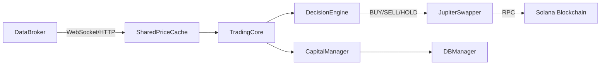

# PhantomTrader Documentation

> **V10.5 SRP Architecture** — Solana Memecoin Swing Trading Bot

Welcome to the comprehensive documentation for PhantomTrader, a sophisticated automated trading system for Solana memecoins.

---

## 📚 Documentation Index

| Document | Description |
|----------|-------------|
| [Quickstart](./QUICKSTART.md) | Get running in 5 minutes |
| [Architecture](./architecture.md) | System design & component overview |
| [Configuration](./CONFIGURATION.md) | All settings & parameters explained |
| [Trading Strategies](./TRADING_STRATEGIES.md) | RSI scalping, Keltner, VWAP, Longtail |
| [Risk Management](./RISK_MANAGEMENT.md) | Stop-loss, TSL, position sizing, circuit breakers |
| [Data Pipeline](./DATA_PIPELINE.md) | Price feeds, caching, and data sources |
| [Execution](./EXECUTION.md) | Jupiter swaps, JITO protection, simulation |
| [CLI Reference](./CLI_REFERENCE.md) | Command line options |
| [Telegram Bot](./TELEGRAM_BOT.md) | Remote control integration |
| [API Reference](./API.md) | Core class documentation |
| [Troubleshooting](./TROUBLESHOOTING.md) | Common issues & solutions |

---

## 🏗️ Architecture Overview

PhantomTrader uses a **Single Responsibility Principle (SRP)** architecture organized into three priority tiers:

```
┌─────────────────────────────────────────────────────────────────────┐
│  P0: EXECUTION CORE                                                 │
│  ├── TradingCore (src/engine/trading_core.py)                      │
│  │   └── High-frequency tick loop, trade lifecycle                 │
│  └── Constraint: <10ms cycle, NO blocking I/O                      │
├─────────────────────────────────────────────────────────────────────┤
│  P1: LOGIC & DATA                                                   │
│  ├── DecisionEngine (src/engine/decision_engine.py)                │
│  │   └── Pure logic: RSI analysis, TSL management                  │
│  ├── DataFeedManager (src/engine/data_feed_manager.py)             │
│  │   └── Batch price injection                                     │
│  └── Watcher (src/strategy/watcher.py)                             │
│      └── Per-asset state container                                 │
├─────────────────────────────────────────────────────────────────────┤
│  P2: INFRASTRUCTURE                                                 │
│  ├── DataBroker (data_broker.py)                                   │
│  │   └── Independent process for price feeds                       │
│  ├── DataSourceManager (src/system/data_source_manager.py)         │
│  │   └── Tiered fallback (Jupiter → DexScreener)                   │
│  └── PriorityQueue (src/system/priority_queue.py)                  │
│      └── Async logging and alerts                                  │
└─────────────────────────────────────────────────────────────────────┘
```

---

## 🔄 Data Flow



---

## 📁 Project Structure

```
PhantomTrader/
├── main.py                 # Entry point (V7.0 Dual-Engine)
├── data_broker.py          # Centralized price fetcher
├── config/
│   ├── settings.py         # Global configuration
│   ├── thresholds.py       # Trading thresholds
│   └── rpc_pool.json       # RPC endpoints
├── data/
│   ├── watchlist.json      # Asset definitions
│   ├── trading_journal.db  # SQLite persistence
│   └── price_cache.json    # Cross-process cache
├── src/
│   ├── engine/             # P0/P1 Core Components
│   │   ├── trading_core.py
│   │   ├── decision_engine.py
│   │   └── data_feed_manager.py
│   ├── strategy/           # Trading Logic
│   │   ├── portfolio.py
│   │   ├── watcher.py
│   │   ├── risk.py
│   │   └── signals.py
│   ├── execution/          # Blockchain Interaction
│   │   ├── wallet.py
│   │   ├── swapper.py
│   │   └── paper_wallet.py
│   ├── system/             # Infrastructure
│   │   ├── db_manager.py
│   │   ├── data_source_manager.py
│   │   ├── rpc_pool.py
│   │   └── telegram_listener.py
│   ├── core/               # Shared Utilities
│   │   ├── capital_manager.py
│   │   ├── shared_cache.py
│   │   └── validator.py
│   └── tools/              # Utilities
│       ├── grader.py
│       ├── scout.py
│       └── discovery.py
└── docs/                   # Documentation
```

---

## ⚡ Quick Start

```bash
# 1. Clone & Install
git clone https://github.com/ConsumrBuzzy/PhantomTrader.git
cd PhantomTrader
pip install -r requirements.txt

# 2. Configure
cp .env.example .env
# Edit .env with your SOLANA_PRIVATE_KEY

# 3. Run Monitor Mode (Safe - No Real Trades)
python main.py --monitor

# 4. Run Live Mode (Real Money)
python main.py --live --scalper
```

See [Quickstart Guide](./QUICKSTART.md) for detailed setup instructions.

---

## 🔑 Key Features

| Feature | Description |
|---------|-------------|
| **Multi-Strategy** | RSI Scalper, Keltner Channel, VWAP, Longtail |
| **Paper Trading** | Full simulation with realistic slippage & fees |
| **Trailing Stop Loss** | Dynamic profit protection |
| **ATR Position Sizing** | Volatility-based risk parity |
| **Token Safety** | Mint/Freeze authority, honeypot detection |
| **JITO Protection** | MEV/front-running prevention |
| **Telegram Control** | Remote monitoring and commands |
| **SQLite Journal** | ACID-compliant trade logging |

---

## 📖 Version History

- **V10.5** - SQLite persistence, DBManager singleton
- **V10.2** - SRP architecture refactor
- **V9.7** - Autonomous gas management
- **V8.2** - Trailing Stop Loss (TSL)
- **V7.0** - Dual-engine architecture
- **V5.7** - Token safety validator
