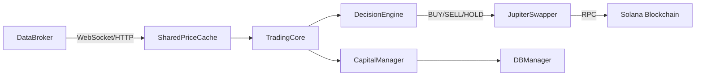

# PhantomArbiter Documentation

> **Version 0.1.0** — Autonomous Solana DeFi Arbitrage & Trading Engine

Welcome to the comprehensive documentation for PhantomArbiter, a sophisticated multi-strategy trading system for the Solana blockchain ecosystem.

---

## 📚 Documentation Index

| Document | Description |
|----------|-------------|
| [Quickstart](./QUICKSTART.md) | Get running in 5 minutes |
| [Architecture](./architecture.md) | System design & component overview |
| [Configuration](./CONFIGURATION.md) | All settings & parameters explained |
| [Trading Strategies](./TRADING_STRATEGIES.md) | RSI scalping, Keltner, VWAP, Longtail |
| [Risk Management](./RISK_MANAGEMENT.md) | Stop-loss, TSL, position sizing, circuit breakers |
| [Data Pipeline](./DATA_PIPELINE.md) | Price feeds, caching, and data sources |
| [Execution](./EXECUTION.md) | Jupiter swaps, JITO protection, simulation |
| [CLI Reference](./CLI_REFERENCE.md) | Command line options |
| [Telegram Bot](./TELEGRAM_BOT.md) | Remote control integration |
| [API Reference](./API.md) | Core class documentation |
| [Troubleshooting](./TROUBLESHOOTING.md) | Common issues & solutions |

---

## 🏗️ Architecture Overview

PhantomArbiter uses a **Hybrid Architecture** combining Python (core logic), Rust (performance-critical paths), and TypeScript (DEX integrations):

```
┌─────────────────────────────────────────────────────────────────────┐
│  FAST TIER (Rust - phantom_core)                    <1ms latency    │
│  ├── WSS Aggregator: Multi-RPC deduplication                       │
│  ├── SignalScorer: Go/No-Go decision logic                         │
│  ├── CycleFinder: Bellman-Ford arbitrage detection                 │
│  └── Multiverse: Multi-hop path scanning                           │
├─────────────────────────────────────────────────────────────────────┤
│  MID TIER (Python Async)                           10-50ms latency  │
│  ├── Director (src/director.py): System orchestration              │
│  ├── TacticalStrategy: Trading logic & execution                   │
│  ├── PhantomArbiter: Arbitrage engine                              │
│  └── ExecutionBackend: Paper/Live trade execution                  │
├─────────────────────────────────────────────────────────────────────┤
│  SLOW TIER (Background Tasks)                      Minutes-Hours    │
│  ├── Scout Agents: Smart money tracking                            │
│  ├── Landlord: Gas management & rent optimization                  │
│  └── DeepScout: ML-based analysis                                  │
├─────────────────────────────────────────────────────────────────────┤
│  BRIDGE LAYER (TypeScript/Node.js)                                 │
│  ├── Orca Daemon: Whirlpools integration                           │
│  ├── Raydium Daemon: CLMM/AMM integration                          │
│  └── Meteora Bridge: DLMM integration                              │
└─────────────────────────────────────────────────────────────────────┘
```

---

## 🔄 Data Flow



---

## 📁 Project Structure

```
PhantomArbiter/
├── main.py                 # Entry point & CLI
├── config/
│   ├── settings.py         # Global configuration
│   ├── thresholds.py       # Trading thresholds
│   └── rpc_pool.json       # RPC endpoint pool
├── src/
│   ├── director.py         # System orchestrator
│   ├── arbiter/            # Arbitrage engine
│   ├── core/               # System kernels & utilities
│   ├── shared/             # Common libraries
│   │   ├── execution/      # Trade execution (paper/live)
│   │   ├── infrastructure/ # RPC, WebSocket, caching
│   │   └── system/         # Capital, signals, routing
│   ├── engines/            # Trading strategies
│   ├── dashboard/          # Rich TUI
│   └── tools/              # Scout, discovery utilities
├── src_rust/               # Rust extension (phantom_core)
│   └── src/
│       ├── multiverse.rs   # Multi-hop path scanner
│       ├── cycle_finder.rs # Arbitrage detection
│       ├── scorer.rs       # Signal scoring
│       └── wss_aggregator.rs # RPC deduplication
├── bridges/                # TypeScript DEX integrations
│   ├── orca_daemon.ts
│   ├── raydium_daemon.ts
│   └── meteora_dlmm.ts
├── apps/                   # Micro-services
│   ├── galaxy/             # 3D visualization dashboard
│   ├── datafeed/           # Market data service (incubating)
│   └── execution/          # Transaction service (incubating)
├── tests/                  # Test suite
│   ├── unit/
│   ├── integration/
│   └── e2e/
└── docs/                   # Documentation
```

---

## ⚡ Quick Start

```bash
# 1. Clone & Install
git clone https://github.com/ConsumrBuzzy/PhantomArbiter.git
cd PhantomArbiter
pip install -r requirements.txt

# Install TypeScript bridges
cd bridges && npm install && cd ..

# 2. Configure
cp .env.example .env
# Edit .env with your wallet and API keys

# 3. Run Monitor Mode (TUI Dashboard)
python main.py pulse

# 4. Run Paper Trading
python main.py --paper

# 5. Run Live Trading (Real Money - Requires explicit config)
python main.py --live
```

See [Quickstart Guide](./QUICKSTART.md) for detailed setup instructions.

---

## 🔑 Key Features

| Feature | Description |
|---------|-------------|
| **Multi-Strategy** | RSI Scalper, Keltner Channel, VWAP, Longtail |
| **Paper Trading** | Full simulation with realistic slippage & fees |
| **Trailing Stop Loss** | Dynamic profit protection |
| **ATR Position Sizing** | Volatility-based risk parity |
| **Token Safety** | Mint/Freeze authority, honeypot detection |
| **JITO Protection** | MEV/front-running prevention |
| **Telegram Control** | Remote monitoring and commands |
| **SQLite Journal** | ACID-compliant trade logging |

---

## 📖 Version History

- **0.1.0** (Current) - Hybrid Architecture (Python + Rust + TypeScript)
  - Phase 4: Institutional Realism milestone
  - Rust acceleration for hot paths
  - TypeScript DEX bridges
  - Galaxy 3D dashboard
