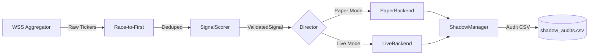

# 🏛️ PhantomArbiter Visual Architecture

> **Last Updated**: Dec 30, 2025 | **Phase**: 4 (Institutional Realism)

---

## System Overview

```
┌─────────────────────────────────────────────────────────────────────────────┐
│                            PHANTOMARBITER                                   │
│                    Institutional-Grade Solana Trading Bot                   │
├─────────────────────────────────────────────────────────────────────────────┤
│                                                                             │
│  ┌─────────────────────────────────────────────────────────────────────┐   │
│  │                        FAST TIER (Rust)                             │   │
│  │                        < 1ms latency                                │   │
│  │  ┌─────────────┐    ┌─────────────┐    ┌─────────────────────────┐ │   │
│  │  │ WSS         │───>│ Race-to-   │───>│ SignalScorer            │ │   │
│  │  │ Aggregator  │    │ First      │    │ (Go/No-Go Decision)     │ │   │
│  │  └─────────────┘    └─────────────┘    └─────────────────────────┘ │   │
│  └─────────────────────────────────────────────────────────────────────┘   │
│                                    │                                        │
│                                    ▼ ValidatedSignal                        │
│  ┌─────────────────────────────────────────────────────────────────────┐   │
│  │                        MID TIER (Python Async)                      │   │
│  │                        10-50ms latency                              │   │
│  │  ┌─────────────┐    ┌─────────────────────────────────────────────┐│   │
│  │  │  Director   │───>│           ExecutionBackend                  ││   │
│  │  │  (Orchest.) │    │  ┌─────────────┐    ┌─────────────┐        ││   │
│  │  └─────────────┘    │  │ PaperBackend│    │ LiveBackend │        ││   │
│  │         │           │  │ (Simulate)  │    │ (Jito/Jup)  │        ││   │
│  │         │           │  └──────┬──────┘    └──────┬──────┘        ││   │
│  │         ▼           └─────────┼──────────────────┼───────────────┘│   │
│  │  ┌─────────────┐              │                  │                │   │
│  │  │ShadowManager│<─────────────┴──────────────────┘                │   │
│  │  │  (Auditor)  │         Compare Fill Prices                      │   │
│  │  └─────────────┘                                                  │   │
│  └─────────────────────────────────────────────────────────────────────┘   │
│                                                                             │
│  ┌─────────────────────────────────────────────────────────────────────┐   │
│  │                       SLOW TIER (Background)                        │   │
│  │                       Minutes-Hours                                 │   │
│  │  ┌─────────────┐    ┌─────────────┐    ┌─────────────┐             │   │
│  │  │   Scout     │    │  DeepScout  │    │  Landlord   │             │   │
│  │  │ (Discovery) │    │   (ML)      │    │ (Gas Mgmt)  │             │   │
│  │  └─────────────┘    └─────────────┘    └─────────────┘             │   │
│  └─────────────────────────────────────────────────────────────────────┘   │
└─────────────────────────────────────────────────────────────────────────────┘
```

---

## Execution Backend (Paper = Live Parity)

```
                    ┌─────────────────────────────────────┐
                    │        ExecutionBackend             │
                    │           (Protocol)                │
                    ├─────────────────────────────────────┤
                    │ + execute_buy() -> TradeResult      │
                    │ + execute_sell() -> TradeResult     │
                    │ + calculate_slippage() [SHARED]     │
                    └───────────────┬─────────────────────┘
                                    │
              ┌─────────────────────┼─────────────────────┐
              ▼                                           ▼
    ┌─────────────────────┐                 ┌─────────────────────┐
    │     PaperBackend    │                 │     LiveBackend     │
    ├─────────────────────┤                 ├─────────────────────┤
    │ • Simulates fills   │                 │ • Submits to Jito   │
    │ • Updates CM state  │                 │ • Real tx_id        │
    │ • Identical slippage│                 │ • Identical slippage│
    └─────────────────────┘                 └─────────────────────┘
              │                                           │
              └─────────────────┬─────────────────────────┘
                                ▼
                    ┌─────────────────────────────────────┐
                    │          ShadowManager              │
                    ├─────────────────────────────────────┤
                    │ • Compares Paper vs Live fills      │
                    │ • Logs delta to CSV                 │
                    │ • Alerts on > 1% deviation          │
                    └─────────────────────────────────────┘
```

---

## Signal Flow



---

## Key Files

| Layer | File | Purpose |
|-------|------|---------|
| **Fast** | `src_rust/src/scorer.rs` | Rust SignalScorer |
| **Fast** | `src_rust/src/wss_aggregator.rs` | Multi-RPC deduplication |
| **Mid** | `src/engine/director.py` | Orchestrator |
| **Mid** | `src/engine/trade_executor.py` | Execution dispatcher |
| **Mid** | `src/shared/execution/execution_backend.py` | Paper/Live backends |
| **Mid** | `src/engine/shadow_manager.py` | Audit system |
| **Slow** | `src/shared/system/capital_manager.py` | State management |

---

## Phase 4 Additions (Dec 2025)

| Component | Location | Status |
|-----------|----------|--------|
| SignalScorer (Rust) | `src_rust/src/scorer.rs` | ✅ Done |
| TradeResult Schema | `src/shared/models/trade_result.py` | ✅ Done |
| ShadowManager | `src/engine/shadow_manager.py` | ✅ Done |
| ExecutionBackend | `src/shared/execution/execution_backend.py` | ✅ Done |
| PaperBackend | `execution_backend.py` | ✅ Done |
| LiveBackend | `execution_backend.py` | ✅ Done |
