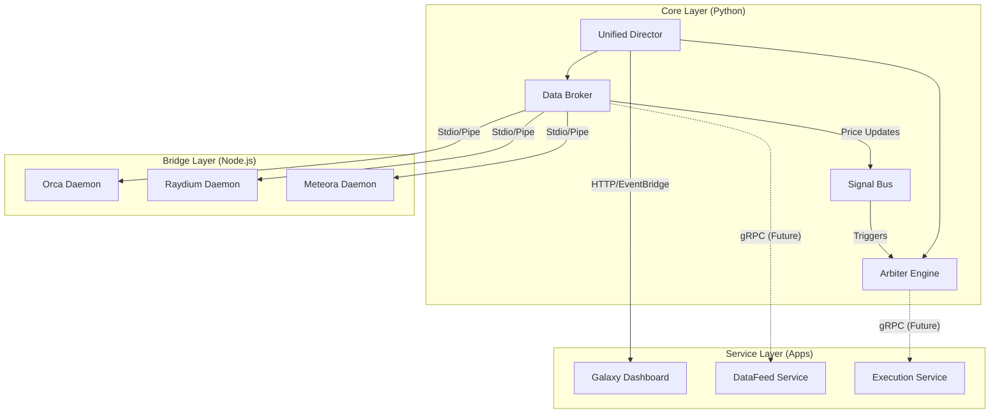

# System Architecture

**Version**: 3.0 (Hybrid)
**Status**: Active / Transitioning

## 🏛️ High-Level Overview

PhantomArbiter uses a **Hybrid Architecture** designed to balance the raw speed of Python's data science ecosystem with the low-level performance of Node.js for Solana interactions and the responsiveness of a web-based UI.

The system is composed of four main layers:
1.  **Core (Python)**: The "Brain" (Decision making, Strategy, State).
2.  **Service Layer (Apps)**: Standalone micro-services for UI and heavy lifting.
3.  **Bridge Layer (Node.js)**: IO adapters for specific Solana AMMs.
4.  **Data Persistence**: Shared memory caches and JSON ledgers.

### System Diagram



---

## 🧩 Component Dictionary

### 1. The Core (`src/`)
| Component | Entry Point | Responsibility |
|-----------|-------------|----------------|
| **Unified Director** | `src/director.py` | System lifecycle, process orchestration, and graceful shutdown. |
| **Data Broker** | `src/core/data_broker.py` | Central nervous system. Aggregates data from WSS, REST, and Bridges. |
| **Arbiter Engine** | `src/arbiter/` | The trading brain. Performs graph traversal (Bellman-Ford/DFS) to find arbitrage loops. |
| **Tactical Strategy** | `src/strategies/tactical.py` | Scalping and trend-following strategies. |

### 2. The Services (`apps/`)
| Service | Status | Port | Description |
|---------|--------|------|-------------|
| **Galaxy** | ✅ Active | `8001` | Visualization Dashboard (FastAPI + Three.js). |
| **DataFeed** | 🚧 Incubating | `9000` | High-throughput market data ingestion (gRPC). |
| **Execution** | 🚧 Incubating | `9001` | Transaction signing and broadcasting (gRPC). |

### 3. The Bridges (`bridges/`)
Node.js processes wrapped by Python classes (`src/shared/execution/*_bridge.py`). They communicate via Standard IO (stdin/stdout) using JSON-RPC style messages.

*   `orca_daemon.js`: Orca Whirlpools SDK
*   `raydium_daemon.js`: Raydium CLMM/CPMM SDK
*   `meteora_bridge.js`: Meteora DLMM SDK

---

## 📡 Data Flow

### The "Hot Path" (Arbitrage)
1.  **Ingest**: Bridge/WSS receives `price update`.
2.  **Normalize**: Data Broker converts to `PricePoint`.
3.  **Cache**: Stored in `SharedPriceCache` (Shm/Memory).
4.  **Signal**: `SignalBus` emits `MARKET_UPDATE` if delta > threshold.
5.  **Compute**: Arbiter Engine updates internal Graph and scans for negative cycles.
6.  **Execute**: If profit > `min_spread`, Executor constructs transaction.

---

## 📂 Directory Structure (spec)

```
.
├── apps/               # Standalone Services
├── bridges/            # Node.js Connectors
├── config/             # Global Configuration
├── docs/               # Documentation (ADR, Roadmap, Arch)
├── src/                # Python Core
│   ├── arbiter/        # Trading Engines
│   ├── core/           # System Kernels
│   └── shared/         # Common Libs
└── transactions/       # Logs & Ledgers
```
