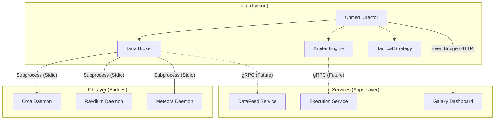

# Architecture Overview: The Hybrid Model

**Status**: implementation (Transitioning)  
**Version**: 3.0 (Hybrid)

## The "Brain + Services" Paradigm

PhantomArbiter uses a hybrid architecture where a central "Brain" (Director) manages internal state and strategy, while offloading specialized IO-heavy or UI-heavy tasks to peripheral "Services" or "Bridges".

### System Diagram

## Layers defined

### 1. The Core (`src/`)
The monolithic heart of the application. It runs in a single process (with threads/asyncio) to maintain nanosecond-level decision latency.

- **Unified Director**: The entry point ensuring all components start in the correct order.
- **Data Broker**: The nervous system. It aggregates ticks from WSS, REST, and Bridges into a `SharedPriceCache`.
- **Arbiter Engine**: The decision maker. Scans the graph for triangular and spatial arbitrage opportunities.

### 2. The Apps Layer (`apps/`)
Standalone applications that can (in theory) run on separate servers.

- **Galaxy (`apps/galaxy`)**: 
    - **Status**: **ACTIVE**
    - **Role**: Visualization & Frontend Hosting.
    - **Tech**: FastAPI + Three.js.
    - **Comms**: Receives events via HTTP (`EventBridge`).

- **DataFeed (`apps/datafeed`)**:
    - **Status**: **INCUBATING**
    - **Role**: High-volume market data ingest (Helius/Triton).
    - **Tech**: gRPC Server.
    - **Goal**: Isolate high-bandwidth WSS handling from the trading core.

- **Execution (`apps/execution`)**:
    - **Status**: **INCUBATING**
    - **Role**: Transaction signing and broadcasting.
    - **Tech**: gRPC Server.
    - **Goal**: Manage nonces and connection pools independently.

### 3. The Bridge Layer (`bridges/`)
Specialized Node.js processes wrapped by Python classes. We use Node.js here because Solana SDK support is often better/faster in JS for certain AMM SDKs (Meteora DLMM, Raydium CLMM).

- **Mechanism**: Python spawns Node process -> Stdin/Stdout JSON pipes.
- **Latency**: < 5ms overhead.
- **Components**: `orca_daemon.js`, `raydium_daemon.js`, `meteora_bridge.js`.

## Data Flow (Hot Path)

1. **Ingest**: `Bridges` or `WSS` receive a price update.
2. **Normalize**: `DataBroker` normalizes it to a standard `PriceEvent`.
3. **Cache**: Event is written to `SharedPriceCache` (Memory).
4. **Trigger**: If delta > threshold, `SignalBus` wakes up `Arbiter`.
5. **Decide**: `Arbiter` checks graph for profitable loops.
6. **Execute**: `Arbiter` sends instructions to `Executor` (currently internal, moving to Service).
